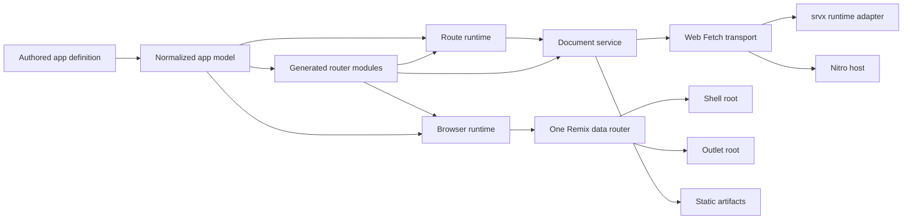

# Architecture

Flamefront is a coordinator. It does not replace Octane, Remix Router, Vite,
srvx, or Nitro. It gives them one route model and assigns each library a narrow
job.

## Ownership

The dependency flow starts with the authored app definition and ends at browser
or HTTP behavior:

The arrows are ownership dependencies, not import statements. For example, the
browser runtime consumes a generated router through the Remix Router adapter,
but it still uses the normalized app model to decide whether startup hydrates or
renders.

## Shell and outlet ownership

Every application has two framework-owned UI regions. The shell root owns the
persistent shell and the document chrome. The routed outlet root owns the
current route and any matched pathless layouts placed below the shell's
`<Outlet />`. On the browser, the shell root is attached to `#root` and the
outlet root is managed beneath the shell's outlet host.

The regions always share one authoritative Remix data router and one live
location. The outlet root receives the router, router state, location,
navigation, fetcher, route, and view-transition contexts through a bridge; it
does not create a second router. The two roots use separate identifier
namespaces: `flamefront-shell-` for shell rendering and `flamefront-outlet-`
for outlet rendering and hydration.

This is an ownership split, not a route-tree split. A `layout(...)` node remains
part of the generated route hierarchy and its fragment boundary metadata, but it
does not create an independent root or receive an independent hydration policy.

## App model

`defineApp` validates the shell, layouts, paths, render modes, shell and route
hydration policies, and routing options. It defaults `shellHydration` to
`full`, freezes the normalized route tree and leaf list, and exposes the
normalized shell policy for generated metadata. The resulting object also owns
URL matching and the shared route-data client.

This is the only layer allowed to decide which authored route matches a URL.
Server transport, browser prefetch, static generation, and document rendering
all ask the app model rather than implementing their own matcher.

`basename` and `dataPath` are normalized with the app. They then flow into
generated router configuration, data requests, fragment cache keys, Web
transport classification, srvx classification, and static output requests.

## Generated router modules

The Vite integration evaluates the app manifest and exposes three virtual
modules. The browser module contains the eager shell, lazy layouts and routes,
route metadata, data loaders, and route-module preloaders. Shell metadata
includes the normalized `shellHydration` policy. The server module is an
importer over unique leaf entries. The server-entry module selects the Web
Fetch entry by default, the srvx adapter for `target: "node" | "deno" | "bun"`,
or the Web entry for `adapter: "nitro"`.

Server and static routes share one generated fragment route shape in the
browser. The generated loader selects the server or static cache policy. The
fragment route inserts response HTML before optional nested hydration. Client
routes keep the route-data and module path. Fragment navigation does not import
the authored route module as its normal browser rendering path.

During browser builds, Flamefront removes `loader` and other server-only route
exports together with private dependencies that become unreachable. A separate
resolver guard rejects `.server` modules and server directories that remain in
the client graph. Source-map content for authored route modules is removed from
client output because those sources may contain server code even after the
executable graph is clean.

## Route runtime

The route runtime has no renderer or transport dependency. It matches a
sanitized request, creates request-scoped context, imports the matched route
module, and runs its loader. It also exposes the route-data response used by the
generated browser loaders.

The importer is generated for the server, but injected into the runtime. This
keeps module loading testable and makes the server-only module boundary
explicit.

## Document service

`createOctaneDocuments` joins the route runtime to Remix Router and Octane. It
has three operations:

- `renderDocument` renders shell, client, server, or static documents and
  composes the resulting body, CSS, and hydration payload into an HTML template;
- `loadRouteData` delegates to the route runtime;
- `renderFragment` renders the boundary chain for one server or static route
  and packages a fragment artifact.

The service does not read files, listen on sockets, or choose response headers.
Those are transport concerns.

The renderer and router are injectable. Focused tests use small fakes, while the
default adapter dynamically imports compiler-aware Octane and Remix Router
modules. Keep assertions about external component representations at that
adapter boundary.

## Transport and lifecycle

`createFetchServerEntry` wraps the document service in Web HTTP behavior. It
handles the data endpoint, fragment requests, document requests, headers,
middleware, and the basename redirect without reading a filesystem. The srvx
adapter adds static asset fallback and filesystem-backed template and fragment
lookup. Nitro can consume the same Web entry while providing its own build,
storage, caching, and deployment layers.

The CLI lifecycle owns files and processes. It starts Vite in middleware mode
for development, runs separate client and server builds, invokes the built
server entry for prerendering, and uses srvx as the local preview host. Keeping
this work out of the document service lets builds call rendering directly
without simulating an HTTP round trip.

## Browser runtime

The browser adapter consumes the server's hydration payload and creates one
Remix Router instance. It attaches the shared router document to the shell root
at `#root`; the shell's boundary then manages the routed outlet root. A client
route mounts its outlet after router initialization. Server and static routes
hydrate the existing outlet markup when their route policy permits it.

Shell hydration is independent of the route policy. `full` activates the shell
at startup, `none` leaves the shell dormant permanently, and `deferred` waits
for the first location change before activating. Deferred activation reads the
router's current state, so a navigation that occurred while the shell was
dormant is not replayed from the initial server location. Generated shell
triggers use their normal Octane hydration semantics.

When the outlet root hydrates or mounts, the context bridge keeps its Remix
hooks and links attached to the live shared router. A dormant shell therefore
does not prevent outlet navigation.

Route-aware prefetch follows the navigation split. Client routes warm route
data and their client module. Server and static routes warm a fragment response
and do not preload the authored route module as a rendering path.
