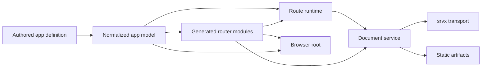

# Architecture

Flamefront is a coordinator. It does not replace Octane, Remix Router, Vite, or
srvx. It gives them one route model and assigns each library a narrow job.

## Ownership

The dependency flow starts with the authored app definition and ends at browser
or HTTP behavior:

The arrows are ownership dependencies, not import statements. For example, the
browser root consumes a generated router through the Remix Router adapter, but
it still uses the normalized app model to decide whether startup hydrates or
renders.

## App model

`defineApp` validates the shell, layouts, paths, render modes, hydration
policies, and routing options. It freezes the normalized route tree and leaf
list. The resulting object also owns URL matching and the shared route-data
client.

This is the only layer allowed to decide which authored route matches a URL.
Server transport, browser prefetch, static generation, and document rendering
all ask the app model rather than implementing their own matcher.

`basename` and `dataPath` are normalized with the app. They then flow into
generated router configuration, data requests, fragment cache keys, srvx
classification, and static output requests.

## Generated router modules

The Vite integration evaluates the app manifest and exposes two virtual
modules. The browser module contains the eager shell, lazy layouts and routes,
route metadata, data loaders, and route-module preloaders. The server module is
an importer over unique leaf entries.

Static routes take a different browser path from live routes. Their generated
route configuration uses fragment loading. Trigger-based policies and `none`
also use a generated hydration component. Static navigation does not make the
authored route module its normal rendering path.

During browser builds, Flamefront removes `loader` and other server-only route
exports together with private dependencies that become unreachable. A separate
resolver guard rejects `.server` modules and server directories that remain in
the client graph. Source-map content for authored route modules is removed from
client output because those sources may contain server code even after the
executable graph is clean.

## Route runtime

The route runtime has no renderer or transport dependency. It matches a
sanitized request, creates request-scoped context, imports the matched route
module, and runs its loader. It also exposes the route-data response used by the
generated browser loaders.

The importer is generated for the server, but injected into the runtime. This
keeps module loading testable and makes the server-only module boundary
explicit.

## Document service

`createOctaneDocuments` joins the route runtime to Remix Router and Octane. It
has three operations:

- `renderDocument` renders shell, client, server, or static documents and
  composes the resulting body, CSS, and hydration payload into an HTML template;
- `loadRouteData` delegates to the route runtime;
- `renderFragment` renders the boundary chain for one static route and packages
  a fragment artifact.

The service does not read files, listen on sockets, or choose response headers.
Those are transport concerns.

The renderer and router are injectable. Focused tests use small fakes, while the
default adapter dynamically imports compiler-aware Octane and Remix Router
modules. Keep assertions about external component representations at that
adapter boundary.

## Transport and lifecycle

`createSrvxServerEntry` wraps the document service in HTTP behavior. It handles
the data endpoint, fragment requests, document requests, static asset fallback,
headers, middleware, and the basename redirect. It returns one object consumed
by the dev server, production preview, and static build.

The CLI lifecycle owns files and processes. It starts Vite in middleware mode
for development, runs separate client and server builds, invokes the built
server entry for prerendering, and starts srvx for preview. Keeping this work out
of the document service lets builds call rendering directly without simulating
an HTTP round trip.

## Browser root

The browser adapter consumes the server's hydration payload, creates a Remix
Router instance, and attaches the shared router document to `#root`. A client
route renders immediately. Server and static routes wait for router
initialization and hydrate the existing document.

Route-aware prefetch follows the same render split. Live routes warm route data
and their client module. Static routes warm the fragment artifact and do not
preload the authored route module as a rendering path.
