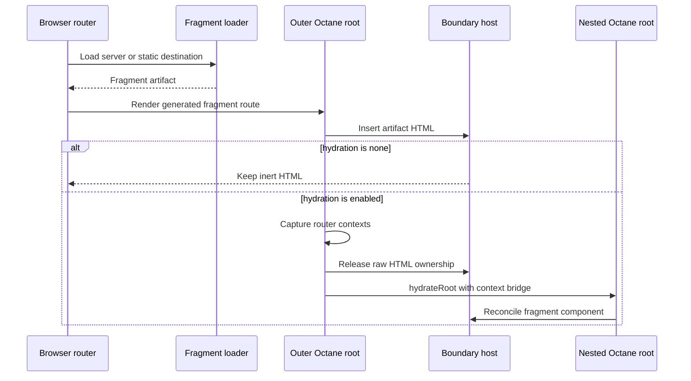

# Route fragments

Route fragments are the HTML-first browser navigation transport for `server`
and `static` routes. A fragment carries rendered boundary HTML and enough route
state for the browser router to adopt the response without replacing the whole
document. `client` routes keep their data-and-module rendering path.

Render mode and fragment transport answer different questions. Render mode
decides when Flamefront produces the HTML. The fragment transport decides how
the browser receives and inserts it during navigation.

## Shell and routed outlet

The shell and routed outlet are always separate ownership regions. The shell
root owns the persistent document chrome at `#root`; the outlet root owns the
current route and matched layouts below the shell's `<Outlet />`. They share one
authoritative browser router and one live location. The outlet root receives
that router's contexts through the bridge described below rather than creating a
second router.

Direct server and static documents render the outlet HTML into a stable host
inside the shell region. Browser startup then hydrates or mounts that host as an
independent outlet root. Fragment navigation replaces the outlet's selected
boundary without replacing the document or changing shell ownership. The shell
policy and each route's hydration policy are evaluated independently.

Only these shell and outlet regions have independent root ownership. A pathless
`layout(...)` is still a generated route boundary and remains inside the
routed hierarchy; it is not independently split or independently hydratable.

## Protocol contract

A fragment response uses the protocol identifier
`flamefront-route-fragment-v1` and contains:

- the authored route path and selected leaf boundary;
- leaf HTML for the common replacement path;
- route data;
- an ordered boundary chain with shell, layout, and route identities;
- the route hydration policy;
- the rendered status code.

Boundary IDs come from generated route metadata. The renderer can reproduce the
exact hierarchy selected by the server router instead of treating a leaf
component as an isolated page.

The browser marks a route URL with `__flamefront_fragment=1` and requests the
fragment media type. Flamefront strips that reserved parameter before matching
the route or exposing the request to app code. Ordinary search parameters stay
on the request.

## Server and static sources

Server fragments are live responses. The Web Fetch entry calls the document
fragment renderer, which runs the server router and loaders for the sanitized
incoming request. URL state, cookies, request headers, redirects, errors,
response status, and application header policy follow the existing server
rendering path. An srvx target supplies the host around that same entry.

Static fragments are build output. The static build writes
`.fragment.html` and `.fragment.json` beside the route document and data file.
The HTML file is the selected fragment as markup. The JSON file is the browser
protocol artifact with route data, hierarchy, hydration policy, and status. The
selected host reads the JSON file for a static fragment request through the
Fetch entry's `loadStaticFragment` asset callback. The srvx adapter wires that
callback to the filesystem and may use the document renderer if the artifact
is absent.

Fragment requests for client routes and unmatched URLs return 404. Server
fragment requests never probe the static output directory.

## Cache and render handoff

Static artifacts are immutable for one deployed build. The browser caches them
by origin and normalized pathname, with the configured basename removed.
Prefetch and navigation share the same fulfilled artifact. Ordinary query
parameters do not create another static cache entry. A failed request leaves
the cache so a later load can retry.

Server responses depend on the request. Their key is the full sanitized route
URL, including ordinary search parameters. The browser shares only concurrent
requests for the same key. It removes the request entry after success, failure,
or cancellation, so a later prefetch or navigation performs a fresh render.

The route component still needs the response after the server request leaves
the in-flight map. A separate latest-artifact handoff retains the response for
the route URL currently being rendered. This handoff is render state, not a
network cache. The next load for that URL replaces it.

Aborting a consumer rejects that consumer's load. If cancellation stops the
underlying request, the failed entry leaves its request map so a later load can
retry.

## Insertion and hydration

The outer route initially renders a boundary host with
`dangerouslySetInnerHTML`. This makes the response HTML visible without running
the authored route component in the browser. In a direct document, this host is
the shell's routed outlet host; during fragment navigation it is the selected
fragment boundary.

Hydration happens later in a layout effect. Before creating the nested root,
Flamefront copies the host HTML, clears Octane's dangerous-HTML ownership, and
restores the same DOM as ordinary host content. The nested root can then adopt
and reconcile those nodes. Two roots must never own the same child tree.

Cleanup marks an asynchronous hydration attempt inactive and unmounts the
current nested root. A navigation or effect rerun cannot leave an old root
reconciling a reused host.

## Router context bridge

Octane context does not cross root boundaries. Without a bridge, the nested
root would lose the Remix Router contexts supplied above the generated fragment
route. Hooks such as `useLocation`, `useNavigate`, `useMatches`, and
`useFetcher` would read defaults or fail.

The outer route reads the current data-router, router-state, fetcher, location,
navigation, route, and view-transition contexts. `createContextBridge`
re-provides those exact live values around the hydrated route component inside
the nested root. The same bridge connects the shell root to its independently
owned outlet root.

The shell root uses the `flamefront-shell-` identifier namespace. Outlet roots
and fragment hydration roots use `flamefront-outlet-`, keeping generated IDs
distinct across the two owners.

The bridge exists because fragment content hydrates in a nested root. If the
original root owns fragment content in the future, remove the bridge with the
nested root.

## Hydration policies

`none` leaves inserted fragment HTML inert. Every other accepted policy permits
post-insertion hydration. The `idle`, `visible`, `interaction`, and `media`
policies wrap the route component in an Octane hydration boundary and control
when its code becomes active. These route policies affect the outlet only;
`shellHydration` controls the shell root.

The fragment route decides whether nested hydration can start. The generated
Octane boundary decides when the authored component runs. Keep those jobs
separate when changing policy generation.

## Boundary rendering

The document fragment renderer finds the selected boundary in the server
router's current matches. It slices the match list at that boundary, recreates
the required Remix Router contexts, and renders the remaining hierarchy. The
document service repeats this for each metadata item in the leaf's parent chain
and stores the resulting HTML in order.

`createRouteBoundary` omits the outer host for the selected boundary during this
pass. Without that target context, normal document rendering wraps every
generated shell, layout, and route node in a stable `display: contents` host.
