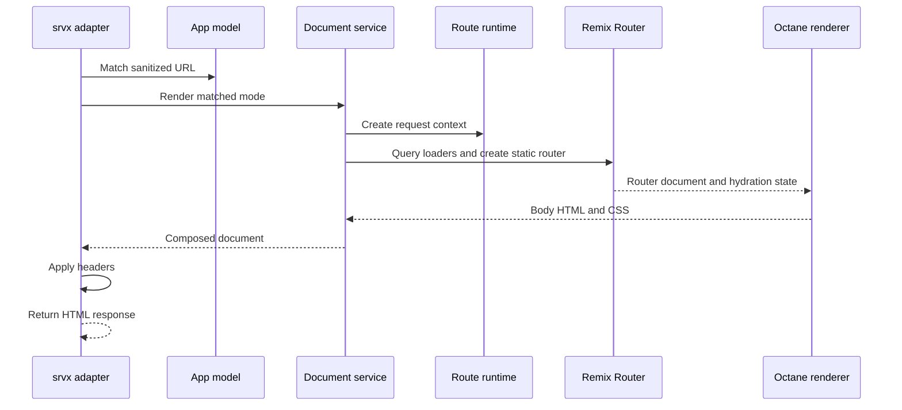
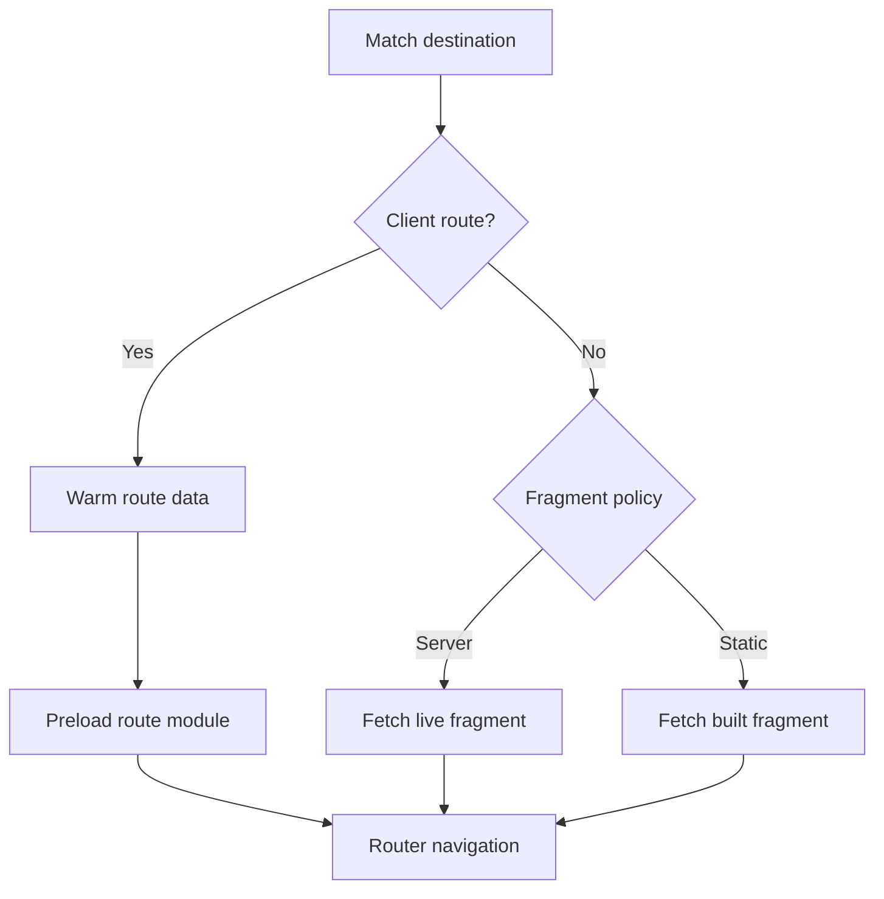

# Lifecycles

This document follows work over time. [Architecture](./architecture.md) defines
who owns each step.

## HTTP classification

The srvx adapter classifies requests in this order:

| Request                    | Owner                                              |
| -------------------------- | -------------------------------------------------- |
| App basename with no match | Redirect to the first client route when one exists |
| Configured data path       | Route runtime data response                        |
| Route fragment protocol    | Live renderer or static artifact, selected by mode |
| Matched route              | Mode-aware document rendering                      |
| Unmatched path             | Static middleware, then a 404                      |

Framework protocol parameters affect classification only. The adapter creates a
sanitized request before matching again, invoking loaders, or calling document
rendering.

## Server document request

For `server` and `static` modes, Remix Router queries the route hierarchy and
produces loader data, errors, status, and matches. The document service renders
the shared router document with that router and context. It serializes loader,
action, and error state into the hydration script.

For `client` and explicit `shell` modes, the document service creates a minimal
static router context around the root route. It does not run the matched route's
loader. The resulting document supplies the browser shell.

Redirect `Response` objects from router queries escape document rendering and
become HTTP responses unchanged.

## Route-data request

Client-route browser loaders call the configured data endpoint with the
original route URL in a query parameter. The srvx adapter delegates directly to
the route runtime. The runtime sanitizes the URL, matches it, creates request
context with purpose `data`, imports the route module, and runs its loader.

The browser data client deduplicates in-flight loads. Prefetch and later
navigation therefore share one promise and one response. A failed request leaves
the cache so a later attempt can retry.

Static route data bypasses the live endpoint and comes from the generated
`.data.json` artifact.

## Browser startup

The browser removes the serialized hydration payload from the document after
reading it. It creates the route prefetch callback and Remix Router instance,
then selects root behavior from the matched Flamefront route:

- a `client` route calls `createRoot` and renders the router document;
- a `server` or `static` route waits for router initialization, then calls
  `hydrateRoot` with the same router document used on the server.

Waiting matters because a hydrated document must start with the same router
state that produced its HTML.

## Browser navigation and prefetch

Client navigation and fragment navigation use different resources:

Prefetch never performs navigation. It only warms the resources that navigation
will consume. Server and static prefetch avoid importing the authored route
module because fragment HTML is the rendering source.

For a server destination, the generated route loader fetches a request-time
fragment. Concurrent loads for the full sanitized URL share one request. The
entry leaves the in-flight map when it settles, so a later navigation renders
again. For a static destination, the loader retains the fulfilled build
artifact by origin and normalized pathname.

The route component reads a separate artifact handoff, inserts its HTML, and
hydrates it only when the route policy permits hydration. The cache and DOM
ownership rules are documented in [route fragments](./fragments.md).

## Production build

`ff build` runs these phases:

1. Remove the previous `dist` directory.
2. Build the browser output and Vite manifest.
3. Build `src/entry-server.ts` as `dist/server/server.js`.
4. Preserve the unrendered client template for server requests.
5. If the app has a client route, render one shell document into the client
   fallback `index.html`.
6. For each static route, invoke the built server entry and write the document,
   route data, fragment HTML, and fragment JSON.

Parameterized or splat static routes cannot be written without concrete paths,
so static generation rejects them. Output path checks also prevent decoded
segments from escaping the client build directory.

The build invokes the built server entry rather than importing application
source into the CLI process. This checks the same server bundle used by preview
and deployment.

## Development and preview

Development runs Vite in middleware mode. Requests that belong to the app load
`src/entry-server.ts` through Vite SSR and create a short-lived manual srvx
server entry. Other requests fall through to Vite's middleware.

Preview loads the built server entry and starts srvx against `dist/client`.
Neither mode has a separate routing implementation. Both consume the same
server entry contract used by the build.
