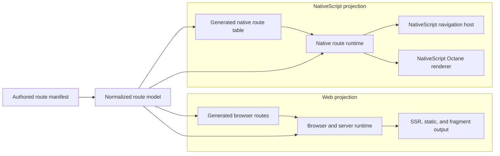

# NativeScript architecture

> Define the boundary between Flamefront's shared route model, its web router,
> and a NativeScript router backed by Octane.

## Core ideas

- The manifest compiler is shared; navigation state and rendering runtimes are
  not.
- The same URL must produce the same ordered route matches and params on web and
  NativeScript.
- The web projection continues to target browser routing, SSR, and fragments.
- The native projection targets a NativeScript host and contains no DOM path.
- Generated route-module keys are private implementation details, not public
  URL identities.

## Proposed shape



The compiler shares the route model and matching rules. Each projection then
owns its module format, data lifecycle, rendering context, and navigation
adapter. This is a compilation boundary, not two independently authored route
trees.

## Shared responsibilities

The platform-neutral layer should own:

| Concern             | Shared behavior                                                    |
| ------------------- | ------------------------------------------------------------------ |
| Route structure     | Paths, layouts, nesting, and leaf routes.                          |
| URL semantics       | Basename, params, relative paths, links, and redirects.            |
| Route identity      | Stable generated metadata and private match keys.                  |
| Type generation     | Route paths, params, module associations, and loader data.         |
| Matching            | One conformance-tested matcher used by both projections.           |
| Manifest validation | Duplicate paths, invalid nesting, and incomplete platform entries. |

The native runtime must not reimplement path matching from the generated native
component table.

## Platform responsibilities

| Web                                       | NativeScript                            |
| ----------------------------------------- | --------------------------------------- |
| React Router-compatible route graph       | Native route-module table               |
| `loader` and server request context       | `clientLoader` and request cancellation |
| HTML shell, SSR, static output, fragments | NativeScript `Frame`/`Page` navigation  |
| Browser router and hydration              | Native router context and `Outlet`      |
| `window`, `document`, and DOM ownership   | NativeScript views rendered by Octane   |

The existing browser-specific files remain behind the web adapter boundary. In
particular, the native graph must not import `flamefront/fragment`, the browser
`RouterDocument`, or `startOctaneClient`.

## Navigation authority

Flamefront prepares a destination: it matches the URL, imports the route chain,
and runs the applicable client loaders. A NativeScript navigation host commits
the destination to the physical stack and reports user-driven changes such as
back navigation back to the router.

This avoids having a JavaScript URL state machine and a NativeScript stack make
independent decisions about the current route.

## Package boundary

The eventual package boundary should make accidental imports difficult:

```text
flamefront core       manifest, matcher, hrefs, route types
flamefront web        browser router, SSR, fragments, web loaders
flamefront nativescript  native router, contexts, host adapter, client loaders
```

The names are provisional. The important property is that the native entry
point does not pull browser or server dependencies into the native graph.
