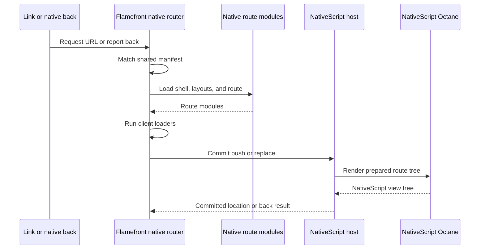

# NativeScript route runtime

> Define how a matched Flamefront route becomes a NativeScript view tree while
> NativeScript remains the authority for physical navigation.

## Core ideas

- Native route preparation mirrors the route chain, not the browser DOM tree.
- Parent-to-leaf loaders run before a destination is committed.
- A native `Outlet` renders nested layouts and route content through Octane.
- The navigation host owns push, replace, back, and transition outcomes.
- Native route context is separate from the browser Remix Router context.

## Responsibilities

The native runtime should provide:

- `NativeRouterProvider`;
- `Outlet` and outlet context;
- `Link`, `NavLink`, and `Navigate`;
- location, params, matches, navigation, and loader-data hooks;
- route-scoped errors and redirects;
- lazy route-module loading and preparation cancellation;
- a `NativeNavigationHost` adapter contract.

It should be implemented on universal/native Octane primitives and native
contexts. It should not depend on browser `window` or `document` globals.

## Navigation flow



Loader failure, redirect, or an unavailable module stops preparation before the
host commits the destination. A host-reported back action updates the router's
location and causes a new match rather than directly mutating router state.

## Navigation host contract

The first host adapter can wrap a NativeScript `Frame` or `Page`:

```ts
interface NativeNavigationHost {
  getLocation(): URL
  push(location: URL, route: PreparedRoute): Promise<void>
  replace(location: URL, route: PreparedRoute): Promise<void>
  back(): Promise<void>
  subscribe(listener: (location: URL) => void): () => void
}
```

The exact NativeScript adapter API is open. Its invariant is not: Flamefront
does not independently mutate a stack after asking the host to commit it.

The MVP should support one stack. Tabs, named stacks, and retained branches can
be added through the host interface without changing the manifest matcher.

## Match-chain rendering

After preparation, the runtime recursively renders the shell, matched layouts,
and leaf route. Each layer receives native route context and renders its child
through `Outlet`. This is the native analogue of the browser's nested route
rendering, but it does not share the browser's DOM boundary or hydration logic.

The runtime should retain only the state required by the selected navigation
policy. It should not copy Flutter-specific WebView snapshots or DOM retention
mechanisms into NativeScript.

## Mounting and lifetime

The application entry mounts the top-level native component using the
NativeScript Octane root API. Each NativeScript window owns its root and must
unmount it when the window closes. The navigation host owns page/stack lifetime;
route components own only their route-local resources.

## Loading and cancellation

Preparation should use one abort signal per attempted navigation. Starting a
new navigation aborts superseded module and loader work. A completed host commit
must not be replaced by a late result from an older attempt.

Redirects and errors remain entry-scoped: a redirect changes the destination,
while an error is rendered by the nearest native error boundary in the matched
chain.
