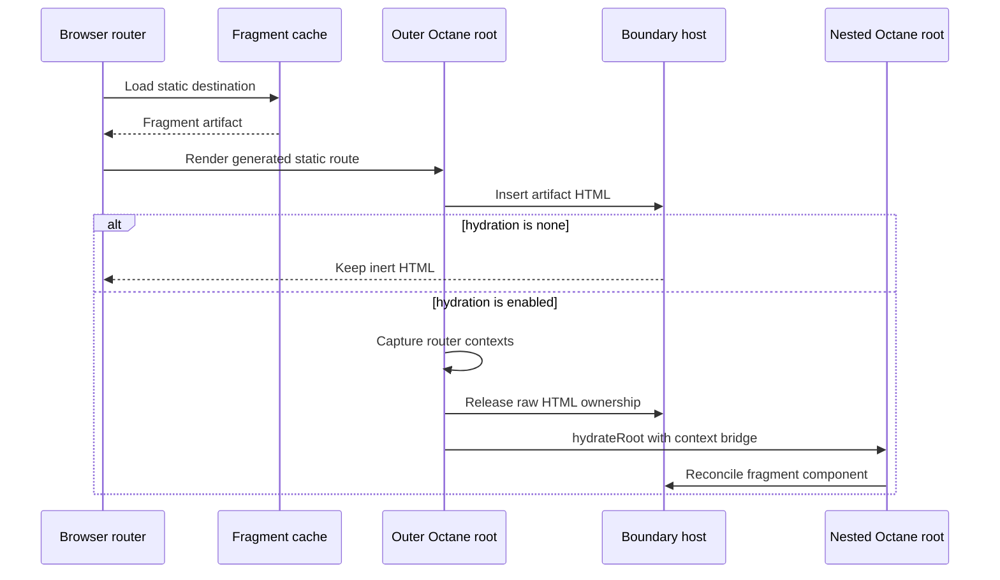

# Static fragments

Static fragments let browser navigation reuse build-time HTML without replacing
the whole document or importing the authored static route module as the normal
browser rendering path.

This subsystem is deliberately separate from static route data. Data can be
consumed by loaders or application code. A fragment carries renderable boundary
HTML and the metadata needed to adopt it.

## Artifact contract

A fragment artifact uses the protocol identifier
`flamefront-static-fragment-v1` and contains:

- the authored route path and selected leaf boundary;
- leaf HTML for the common replacement path;
- route data;
- an ordered boundary chain with shell, layout, and route identities;
- the route hydration policy;
- the rendered status code.

Boundary IDs come from generated route metadata. A static route can therefore
render the exact hierarchy selected by the static router rather than treating
the leaf component as an isolated page.

The static build writes both `.fragment.html` and `.fragment.json`. The HTML
file is a direct representation of the selected fragment. The JSON file is the
browser navigation protocol and includes data, hierarchy, policy, and status.

## Request and cache behavior

The browser marks a route URL with `__flamefront_fragment=1` and requests the
fragment media type. The srvx adapter strips reserved parameters, verifies that
the sanitized URL matches a static route, then reads the built JSON artifact. If
the file is absent and a fragment renderer is available, it renders the
artifact on demand.

The browser cache key uses origin plus the route pathname with the configured
basename removed. Framework query parameters do not affect the key. A cached
promise is shared by prefetch and navigation. Rejected promises are removed so
a later navigation can retry. Aborting one consumer rejects that consumer's
wrapper without discarding shared work for other consumers.

## Insertion and hydration

The outer route initially renders a boundary host with
`dangerouslySetInnerHTML`. This makes the already generated HTML visible without
running the route component.

Hydration happens later in a layout effect. Before creating the nested root,
Flamefront copies the host HTML, clears Octane's dangerous-HTML ownership, and
restores the same DOM as ordinary host content. The nested root can then adopt
and reconcile those nodes. Two roots must never believe they own the same child
tree.

Cleanup marks an asynchronous hydration attempt inactive and unmounts the
current nested root. A navigation or effect rerun cannot leave an old root
reconciling a reused host.

## Why the context bridge exists

Octane context does not cross root boundaries. The nested root would otherwise
lose every Remix Router context supplied above the generated static route.
Hooks such as `useLocation`, `useNavigate`, `useMatches`, and `useFetcher` would
read defaults or fail.

The outer route reads the current data-router, router-state, fetcher, location,
navigation, route, and view-transition contexts. `createContextBridge`
re-provides those exact values around the hydrated route component inside the
nested root.

The bridge is a consequence of nested hydration, not a general provider layer.
If fragment content becomes owned by the original root in the future, remove
the bridge together with the nested root rather than preserving it by habit.

## Hydration policies

`none` leaves inserted fragment HTML inert. Every other accepted static-route
policy permits post-insertion hydration. Generated idle, visible, interaction,
and media policies wrap the route component in an Octane hydration boundary and
control when its code becomes active.

The fragment route still decides whether nested hydration is possible. The
generated Octane boundary decides when the authored component runs. Keep those
two responsibilities distinct when changing policy generation.

## Boundary rendering

The server fragment renderer finds the selected boundary in the static router's
current matches. It slices the match list at that boundary, recreates the
required Remix Router contexts, and renders the remaining hierarchy. The
document service repeats this for each metadata item in the leaf's parent chain
and stores the resulting HTML in order.

`createRouteBoundary` omits the outer host for the selected boundary during this
pass. Without that target context, normal document rendering wraps every
generated shell, layout, and route node in a stable `display: contents` host.
